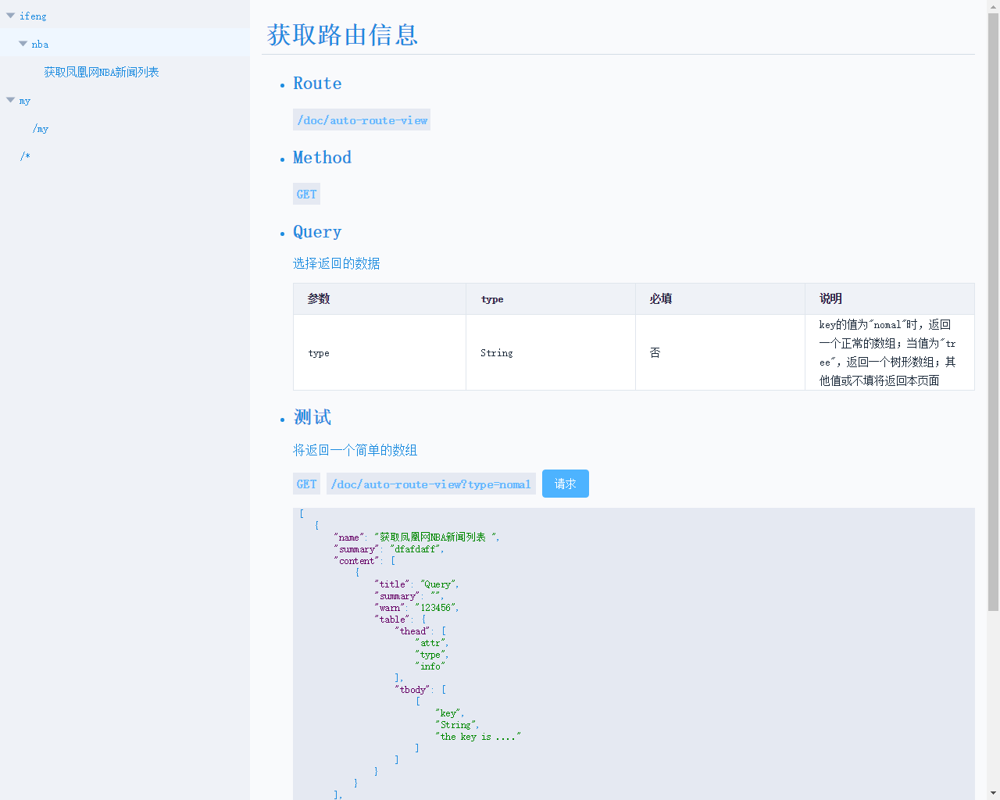

一个小小而简单的express插件，  
用于设置基于文件路径的路由  

## express-dir-routes
---
### 快速使用：

* 在/app.js
  ```js
    var autoDirRoute=require('express-dir-routes');
    var app=require('express')();

    autoDirRoute({
        'app': app,//express实例
        'dir': path.join(__dirname, 'routes'),//放置路由文件的文件夹
        'rename': 'api/v1'//设置路由文件的路由前缀
    })
  ```

* 在/routes/list/GET.js里
   ```js
    module.exports={
        info:{
            name:'list',
            test:{
                query:{
                    testA:'1',
                    testB:'2'
                },
                data:{
                    testA:'this is a post data'
                },
                text:'you can write down something'
            }
        },
        handle:function(req,res,next){
            res.end(req.method+' '+req.url)// 输出 get /api/v1/list
        }
    }   
   ```

* 所以你可以在routes这个文件夹里面新建各种文件夹，然后使用http方法名作为文件名，如：
   ```
   routes
   |--list
      |--article
      |  |--GET.js
      |  |--POST.js
      |  |--DELETE.js
      |  
      |--friend
         |--GET.js
         |--POST.js
    
   ```
   即可解释为：
   ```http
   GET '/list/article';
   GET '/list/friend';
   POST '/list/article';
   POST '/list/friend';
   DELETE '/list/article';
   ```
   
* 因为是个插件，没有修改express实例的任何属性和方法，所以，仍然可以使用  
  ```javascript
   app.get('/',function(req,res,next){
       res.end('homePage')
   });
   app.post('/',function(req,res,next){
       res.end('post homePage')
   })
  ```

---
### 使用说明
* 本插件仅仅只是基于express的`app[method](route,handle)`方法，
对设置为路由文件夹进行遍历，并未修改任何express的属性方法。
* 为了更好的使用本插件，请务必将配置函数写在`body-parse`等相关`express`的中间件后面，不然在`routes handle`文件里面无法使用`request.bod/request.query`等便捷操作
* **方法名文件**，即名字为`(GET|POST|PUT|PATCH|DELETE)`的`.js`文件，
如`GET.js`、`POST.js`文件。本插件会遍历并获取它们的文件名作为请求方法，
获取它们的文件路径作为请求url，读取其暴露的接口作为路由处理函数。
对于其他文件不会做任何处理，所以可以在同级目录下放心地用`.js`文件做该路由文件的分模块处理。
* 关于正则路由的问题，目前仅支持使用`~GET.js`这种文件名解释为：“`/*`”的正则。所以仍然存在局限。
* 方法名文件里面的结构：

  ```javascript
  module.exports={
      info:{},//接口信息
      handle:function(req,res){//处理函数
        /**/
      }
  }
  ```
  请按照上述结构编写接口，info里面的信息可用于生成详细的接口文档。

---
### 生成接口文档
* 插件还提供了一个将读取到的**方法名文件**渲染成一个接口文档的功能。在此插件提供了一套Html页面和数据模板。
* 访问接口：`/doc/auto-route-view`
* 请求方法：`GET`
* query参数  
    <table>
    <tr><th>参数</th><th>类型</th><th>说明</th></tr>
    <tr><td>type</td><td>String</td><td>key有两个值，<br/>当type为nomal时，返回一个包含所有接口的info的简单数组，<br/>当type为tree时，返回一个包含所有接口的info的树形json。<br/>若type不存在或type为其他值时，返回接口文档的html文件</td></tr>
    </table>
* info里面用于渲染的模板参数：
```javascript
info:{
    name:'To get...',//接口的名字
    summary:'something',//接口的摘要信息
    content:[//接口的主要内容
        {
            title:'Query',//小节标题，
            summary:'some words',//小节摘要信息
            warn:'some words',//小节的警告信息
            table:{//创建小节表格
                thead:['Attribute','Type','Info'],//表格头
                tbody:[//表格数据
                    ['type','String','this attribute have two value.One is....']
                ]
            }
        },{
            title:'Data',//小节标题，
            summary:'some words',//小节摘要信息
            warn:'some words',//小节的警告信息
            table:{//创建小节表格
                thead:['Attribute','Type','Info'],//表格头
                tbody:[//表格数据
                    ['post','String','this attribute have two value.One is....']
                ]
            }
        }
    ],
    test:{//提供测试数据
        query:{//url的search参数
            "type":"nomal",
        },
        data:{//用于测试的post data数据
            "post":"123456"
        },
        text:'some words'//有关测试的一些内容说明文本
    }
}
```
渲染之后会是这样子：

